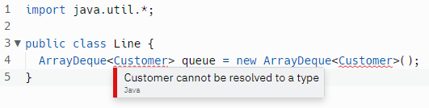
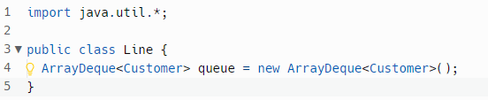

# Ice Cream Truck

Who else remembers the sheer unadulterated pleasure of scoring a treat from the ice cream truck? How about the excitement upon first hearing the telltale jingle in the distance, the race to form a line, and the dizzying menu of seemingly endless choices plastered on the door? Snow cones, firecrackers, ice cream-cookie sandwiches ... the list went on and on.

## Steps
We will need to track the customers that come to our shop. For that, we can implement an Queue. This can be achieved by following our example in [Module 16: Collections > Queue](https://replit.com/@RevUp5/Queue-erickpacheco2#Main.java)


0. Create a new file named `Line.java`.
1. Add the following code to your new file.
   
  ```java
  import java.util.*;

  public class Line {
    ArrayDeque<Customer> queue = new ArrayDeque<Customer>();
  }
  ```
  
  The statement we added creates an ArrayDeque, a subtype of Queue, and assigns it to a corresponding reference variable. This queue can store `Customer` objects. This queue is going to help the Ice Cream Truck. Basically, it will track the customers lining up to get their ice cream. 

But wait, why is there an error?


  This is because we have not created a Customer class yet. Let's fix that!


3. Create a new file `Customer.java`.
4. Add the following code to your new file.
   ```java
   public class Customer {
     private String name;

     public String getName(){
       return this.name;
     }
   }
   ```

   Now go to your `Line.java` file. And voila! 
   

   Notice that the `Customer` class has a `private` variable declared as _name_, which stores a `String`. Additionally, it is pre-configured with a getter method that returns the name of the customer. We don't have a setter function for _name_, that's because we cannot rename our customers. 
  
5. Wait, what? No name?

   Don't worry, we will add the name using the `constructor`. This name will be assigned when we `instantiate` the Customer. Add the following code to your Customer, right below the private variable declaration.

   ```java
    public Customer(String name){
      this.name = name;  
    }
   ```
   
6. Great work! Now is the time we use both component with our Truck. Go to the `Main.java` file. Your file should look something like this.

   ```java
    class Main {
      public static void main(String[] args) {
    
      }
    }
   ```

   Add


  
  Remember, the Common queue operations


    offer: add to the end of the data structure
    poll: remove from the front of the data structure
    peek: get the first element in the data structure

Customers line up to the `Ice Cream Parlor` (queue), so there should be a getter and setter method for the customers. Below what you have so far, inside the Line class, add the following code:
